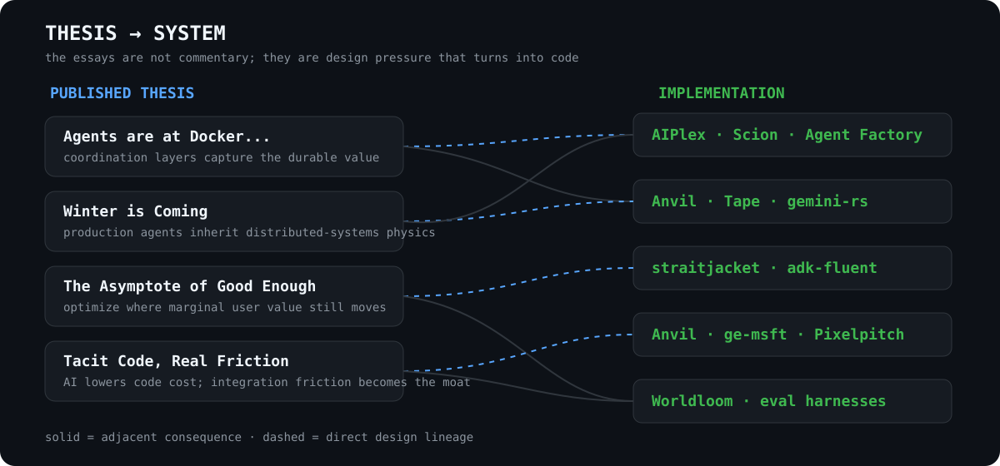

<div align="center">

<picture>
  <source media="(prefers-color-scheme: dark)" srcset="assets/hero.svg">
  
</picture>

<br>

<a href="https://www.linkedin.com/in/vamsiramakrishnan/"></a>
<a href="https://twitter.com/mrvemzi"></a>
<a href="https://mrvemzi.notion.site"></a>

**Forward Deployed Engineering · JAPAC · Google Cloud** · Melbourne, Australia

</div>

I work on the layer between **a model that can do something** and **a system you can trust to keep doing it**: compilers, runtimes, control planes, durable execution, context containment, synthetic worlds, evaluation infrastructure and developer tooling.

> **The model can improvise. The system should know what happened.**

<table>
<tr>
<td><b>NOW</b></td><td><a href="https://github.com/vamsiramakrishnan/straitjacket">straitjacket</a> — context economics for coding agents</td>
</tr>
<tr>
<td><b>RECENT</b></td><td><a href="https://github.com/vamsiramakrishnan/anvil">Anvil</a> — legacy estates → agent-safe capability surfaces</td>
</tr>
<tr>
<td><b>BUILDING</b></td><td><a href="https://github.com/vamsiramakrishnan/synthetic-foundry">Worldloom</a> — coherent synthetic enterprises and eval truth</td>
</tr>
</table>

## Things were compiled.

<div align="center">

</div>

## Start here

| If your problem is… | Start with |
|---|---|
| Agents need to use APIs or legacy middleware safely | **[Anvil](https://github.com/vamsiramakrishnan/anvil)** |
| A coding agent is drowning in tool output | **[straitjacket](https://github.com/vamsiramakrishnan/straitjacket)** |
| An acting agent must survive crashes and partial effects | **[Tape](https://github.com/vamsiramakrishnan/durable-agents)** |
| You need realistic enterprise corpora with ground-truth evals | **[Worldloom](https://github.com/vamsiramakrishnan/synthetic-foundry)** |
| You need a realtime Gemini voice/runtime layer in Rust | **[gemini-rs](https://github.com/vamsiramakrishnan/gemini-rs)** |
| You need to industrialize intent → agent → proof → admission | **[GE Agent Factory](https://github.com/vamsiramakrishnan/ge-agent-factory)** |

## Six systems, six mechanisms

<a href="https://github.com/vamsiramakrishnan/anvil"></a>

<a href="https://github.com/vamsiramakrishnan/straitjacket"></a>

<a href="https://github.com/vamsiramakrishnan/durable-agents"></a>

<details>
<summary><strong>Worldloom · gemini-rs · GE Agent Factory</strong></summary>
<br>
<a href="https://github.com/vamsiramakrishnan/synthetic-foundry"></a>
<br><br>
<a href="https://github.com/vamsiramakrishnan/gemini-rs"></a>
<br><br>
<a href="https://github.com/vamsiramakrishnan/ge-agent-factory"></a>
</details>

## The body of work

```text
INTENT
  │
  ├── contracts / specs ───────► Anvil ─────────────► CLI · MCP · skills · hooks
  │                                └───────────────► legacy API estates
  ├── agent design ─────────────► GE Agent Factory ─► code · evals · passports
  ├── runtime semantics ────────► gemini-rs ────────► voice · state · governed flows
  │                         └───► Tape ─────────────► journal · replay · effects
  ├── fleet / policy ───────────► AIPlex / Scion ───► identity · isolation · routing
  ├── context pressure ─────────► straitjacket ─────► bounded digests · exact retrieval
  ├── synthetic reality ────────► Worldloom ────────► facts · artifacts · eval truth
  └── human surfaces ───────────► Pixelpitch / ge-msft
```

<details>
<summary><strong>More systems — control planes, DX, multi-agent execution and human surfaces</strong></summary>
<br>

| System | What it explores |
|---|---|
| **[AIPlex](https://github.com/vamsiramakrishnan/aiplex)** | One policy plane across agent↔tool, agent↔agent and agent↔model interactions. |
| **[adk-fluent](https://github.com/vamsiramakrishnan/adk-fluent)** | Python + TypeScript fluent builders generated from a shared manifest into native ADK objects. |
| **[Scion](https://github.com/vamsiramakrishnan/scion)** | Isolated container/worktree execution for collaborating deep-agent harnesses. |
| **[Pixelpitch](https://github.com/vamsiramakrishnan/pixelpitch)** | Agent-authored HTML → editable PPTX under explicit visual-fidelity constraints. |
| **[ge-msft](https://github.com/vamsiramakrishnan/ge-msft)** | Gemini Enterprise inside Microsoft 365 with reversible, provenance-bearing actuation. |
| **[antigravity-a2a-a2ui](https://github.com/vamsiramakrishnan/antigravity-a2a-a2ui)** | Identity-derived per-user managed-agent workspaces and credential brokering. |

</details>

## The essays are upstream of the code

<picture>
  <source media="(prefers-color-scheme: dark)" srcset="assets/lineage.svg">
  
</picture>

| Thesis | Systems it pressures |
|---|---|
| **Agents are at Docker. We think we need k8s. We actually need CNCF.** — primitives create coordination problems; durable value moves up-stack. | `AIPlex · Scion · GE Agent Factory` |
| **Winter is Coming** — protocols, frameworks and infrastructure must deliberately compose. | `Anvil · Tape · gemini-rs · AIPlex` |
| **The Asymptote of Good Enough** — optimize only while marginal improvement changes behavior or outcomes. | `straitjacket · adk-fluent · Worldloom` |
| **Tacit Code, Real Friction** — as code gets cheaper, integration, verification and institutional constraints become scarcer. | `Anvil · ge-msft · eval infrastructure` |

<div align="center"><b><a href="https://mrvemzi.notion.site">Read the essays →</a></b></div>

## The profile itself is compiled

This README now dogfoods the same architecture I keep reaching for elsewhere:

```text
portfolio.yaml
      │
      ├── README-facing project diagrams
      ├── social / Open Graph card
      ├── standalone landing page
      ├── generated portfolio index
      └── activity surface
```

`portfolio.yaml` is the canonical model. [`scripts/generate_portfolio.py`](scripts/generate_portfolio.py) emits the projections. [`profile-assets.yml`](.github/workflows/profile-assets.yml) regenerates them when the model changes.

The social card is [`assets/og-card.svg`](assets/og-card.svg). The site projection lives under [`site/`](site/). One source of truth; multiple surfaces.

## Operating principles

```text
01  SPEC > PROMPT                 durable intent should outlive a model call
02  IR > HAND-WIRING             compile multiple surfaces from one source of truth
03  REFUSE > GUESS               uncertainty is information
04  RESUME > RETRY               acting agents need memory of reality
05  ADDRESSES > SUMMARIES        omitted bytes need a deterministic path home
06  EVIDENCE > VIBES             performance claims need receipts
07  PURE COMPOSES; EFFECTS GATE  side effects stay explicit and reviewable
08  LOCAL FIRST                  cloud cost and mutation should be opt-in
09  BORING CONTROL PLANE         spend stochasticity only where it buys leverage
10  DEVEX IS ARCHITECTURE        setup, errors, introspection and docs are system design
```

## Archaeology

The newer agent work sits on older layers: autonomous-driving projects around lane geometry, behavioral cloning and traffic-sign recognition; then Kubernetes, CI/CD, landing zones and operational plumbing. The technologies changed. The recurring interest did not: **how do you turn uncertain behavior into an engineered system with explicit boundaries?**

<div align="center">
<sub>Python for reach · Rust for runtimes · Go for control planes · TypeScript for compilers and product surfaces</sub>
<br><br>
<a href="https://github.com/vamsiramakrishnan?tab=repositories"><b>browse the code</b></a> · <a href="https://mrvemzi.notion.site"><b>read the thinking</b></a>
</div>
